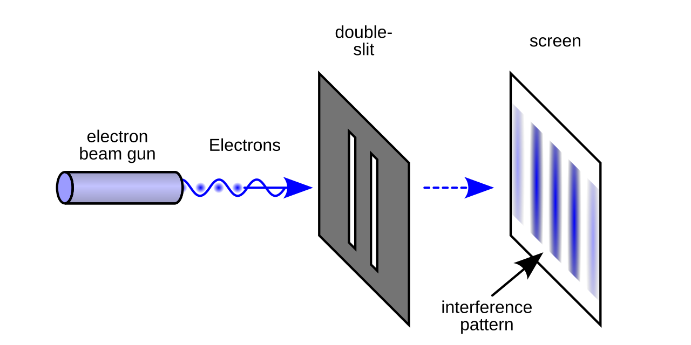

创作虚构作品时，有趣的地方在于，你可以借助角色的视角毫无负担地袒露自己不敢表达的真情实感，这就是我学习写作的重要原因之一——用一种看起来不那么矫揉造作的方式自由表达个人情绪。表达情绪本应是自然而然的事情，但对我来说似乎存在着某种不可违抗的阻力，很难做到坦率、勇敢。很典型的例子是，在我的印象中，所有的问题都是可以自己解决，因此我几乎从来没有向任何人吐槽或者抱怨什么；另外，向别人倾诉让我感到不自在，哪怕对方是最好的朋友或家人。心理学家或许会针对这种行为模式有一些专业判断，但我没有深入想过这些事情，只是觉得它们是性格使然，又或许因为它们没有对我产生太大的困扰，只是偶尔让我感到有些困惑而已。

在我的博客里，很多涉及个人心理分析的文章都被隐藏了，这种做法在我的生活中屡见不鲜：前一天还兴致勃勃地发帖子，内心一旦平静下来，便觉得这种自我暴露的行为太蠢了，于是一口气全都删除。我在过去写的一篇自我分析的文章[^1]里描述过这种行为模式，并且将这种行为模式定义为两种人格的对抗：

> 第一种人格为创造者人格，后一种为毁灭者人格。创造者与毁灭者交替成为我的主人格：创造者不断为我的生活创造并维护新旧关系，并乐意接受外部的评价和批判；毁灭者则会摧毁创造者所有成果，他会切断在他看来没有利用价值的社交关系，破坏刚刚建立起来的新关系，销毁所有可能被别人评价的社交痕迹，如此等等。

有意思的是，这篇文章的命运刚好印证了结论——该文章被我删除了。有相同遭遇的“互联网痕迹”还有很多，但纸质载体上的痕迹就幸运多了，我从没有销毁过它们，一个重要的原因是，它们完全属于我自己，外界接触不到它们，自然也无法评价它们。“不受评价”对我来说是一种安全信号。

这篇文章被删除的直接原因是它暴露了我的“双重人格”，这是我的弱点，或者称之为性格缺陷。有人可能对此并不介意，毫无顾忌地在公共空间对自己的方方面面大谈特谈。但对我来说，这似乎是一种被严厉禁止的行为，至于为什么被禁止，我也说不上什么原因，似乎根植于我的性格之中，某种力量约束着我，要求我只能在公共空间中呈现出“大众可以欣然接受”的一面。这又让我想起了双缝干涉实验[^2]，粒子不被观测时呈现其本来的面目，而当它被观测时，则“虚伪地”表现为迎合大众直觉的样子。

正如写作上述文章时那样，过去某段时间，我通过与自己真诚地对话疗愈心结，而如今，似乎已经失去了那种勇气。我羡慕那些能够稳定更新博客且真诚表达的博客作者，心想，什么时候才能像他们一样坦率自然地表达自己，哪怕是“矫揉造作”的个人情绪。他们的存在，让我愈发意识到公开写作需要勇气——聚焦自我，不受外界目光凝视的勇气。幸运的是，这种勇气短暂存在于我的体内。

2024年的夏天，我在威海的一所小学实习[^3]，那段时期，我遇到了一些让我持续尴尬的事情。事情的起因是办公室有位老师因意外的伤病需要坐轮椅上班，实习生没有义务照顾这位老师，但这份责任阴差阳错地落到了我的头上，由于我不知道如何拒绝，所以每次需要带饭的时候，我的“不情愿”与“不拒绝”这两种心态开始猛烈打架，消耗了我很多心力。直到实习结束，这件事都没有妥善解决。

我本以为这件事就这么草草结束了，没想到一年以后，我特地回忆了这段经历，并写了一篇分析自己讨好型人格的文章[^4]，这篇文章主要依据“我受到家人行为模式的深远影响，导致自己的行为模式趋向于他们的行为模式”，得出“我的讨好型人格来自于家庭文化基因”这一结论。我对家人的“善良行为”表达了质疑，对我来说，善良是一种选择[^5]。

> 无论大事小事，他们受过不少委屈，但在我的记忆中并没有他们努力维护自身权益的事情发生，逆来顺受似乎是这个家庭的文化基因，而这种观念在教育的过程中被描绘成了“善良”……讨好型人格如同一个机器算法操纵着人的行为，表面上看这个人似乎在做善意的举动，实质上在他的心中并没有“善”的概念，他在行动之前并没有选择，他只是在执行一个已经预先编程好的机器指令。对于这种人，你会觉得他是一个善良的人吗？我只是觉得他是一个有用的工具，而这或许就是欺骗他们的人的对他们的看法。

我的第二段实习是在威海实习的半年后，实习公司主要为企业做软件定制服务，我在里面担任后端开发人员。出差期间，繁重的工作让我有些吃不消，原定于周末的休息时间也被占用为工作时间，这种情况下似乎会重演上段实习的尴尬境况：我尽管不乐意，但是依旧忍气吞声，不情不愿地为它工作，最终把自己内耗殆尽，元气大伤。出乎意料的是，我没这么做，而是直截了当地说清楚我作为实习生的职责边界以及诉求：

> 首先，对于今天早上我语气唐突的情况，我深表歉意。周日需要工作的安排确实超出了我的预期，因此一时感到吃惊，还请您理解。其次，我对自己在公司和团队中的定位始终保持清晰：我是实习生。这也是公司在招聘时对应聘者的明确定位。如果我的角色仍是实习生，那么自入职以来……这也意味着，这种自愿行为可以随时终止。总之，我对自己的定位非常明确。在加班与否的问题上，还需视您代表公司传达的实习生角色定位而定。如果公司对我自愿选择不过度加班的行为没有异议，我会继续在约定的工作时间范围内投入精力并尽职尽责。如果对这一点存在不同意见，那么需要另行商议加班费及贵司实习生是否必须加班等相关事宜。2024年12月8日

信件发出去后，我以为自己要收拾行李走人了，但晚上收到消息，他们邀请我去餐馆吃晚饭。晚饭期间谁也没有谈及早上的冲突，后续的日子，我按照原本约定的时间工作，周末也不用加班。这时候我才真正意识到，人的自由需要自己去争取，讨好型人格的善良不过是一种妥协。

之后的日子里，我没再经历过类似让我印象深刻的事件，妥协依旧充斥在生活的方方面面，但不再那么刺骨，或许这就是一种平衡吧。我不敢说自己已经摆脱了讨好型人格的禁锢，无论如何，事态在朝好的方向发展，需要我坚持做的事情也很简单——搞清楚自己究竟想要什么，然后尊重这种意愿。

那篇剖析双重人格的文章和那片反思讨好型人格的文章诞生于我对自己的写作动机最为满意的时期，又或者说是，那是一段怀着一颗真诚的心公开写作的时期。我在此追忆这些往事，正如人们设立纪念英雄人物的动机一样，为了唤醒一些美好的品质——直面自我的勇气。

[^1]: 该文名为[《剖析我的双重人格》](https://github.com/gaotianchi/gaotianchi.github.io/blob/6981807da4913b543ed7ec4765a96de767a1375b/_posts/2025-05-08-analyzing-my-dual-personality.md)，发布于2025年5月8日，起因是和餐馆老板变得非常熟悉之后，我反而不再去该餐馆吃饭了，于是试图搞清楚出现这种心理现象的原因。

[^2]: [双缝干涉实验](https://zh.wikipedia.org/wiki/%E9%9B%99%E7%B8%AB%E5%AF%A6%E9%A9%97)生动诠释了微观粒子的波粒二象性。直觉上，光粒子的运动路径是一条射线，但实际运动过程中会受到缝隙引力的叠加影响，从而偏离原来的轨迹。也就是说，无论观测与否，它都不会走直线。

[^3]: 我的专业是师范类数学与应用数学，学院的培养计划一直围绕着数学教师这一职责展开，三年级上学期为实习期，期间我在威海的一所小学担任一年级数学教师，那是一段令人难忘的时期，有幸认识了很多优秀的老师，以及可爱的学生。[威海蔄山小学初体验](https://www.gaotianchi.com/first-impressions-at-weihaishan-primary-school/)和[实习将尽，思绪纷乱](https://www.gaotianchi.com/internship-ending-more-random-thoughts/)这两篇文章极度粗略地谈了谈这段经历。事实上，这期间发生的事情比文中谈到的丰富得多。

[^4]: 这篇文章现已隐藏，原因同那篇暴露自己双重人格的一样。原文位于[我的讨好型人格溯源与反思](https://github.com/gaotianchi/gaotianchi.github.io/blob/f60271d55289f8e2f5ac6ebc279df9bf1a4569ea/_posts/2025-05-09-analyzing-my-people-pleasant-personality.md)

[^5]: 这句话来自于《发条橙》，这部电影（改编自同名小说）讨论了一个命题：当善良不再是一种选择的时候，做善事的人还是一个善良的人吗？我给出了否定的答案。